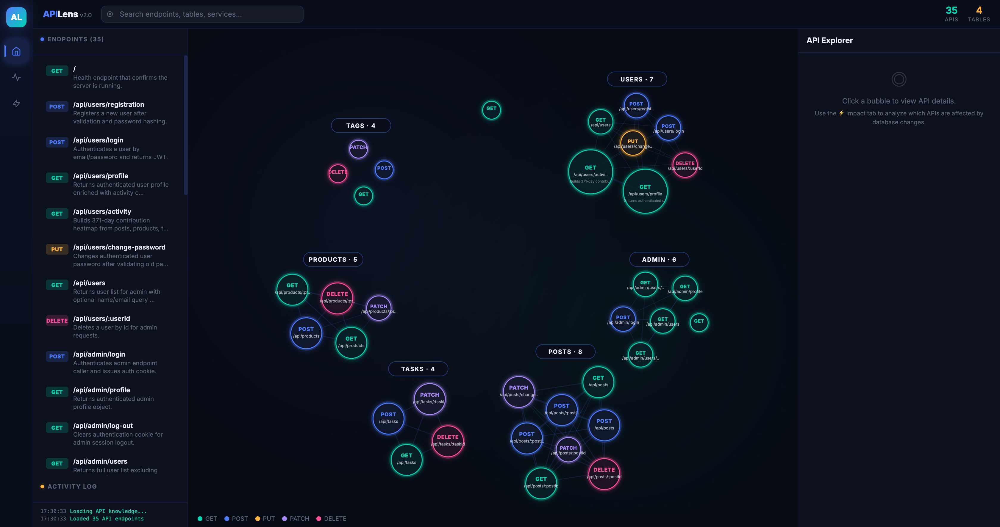
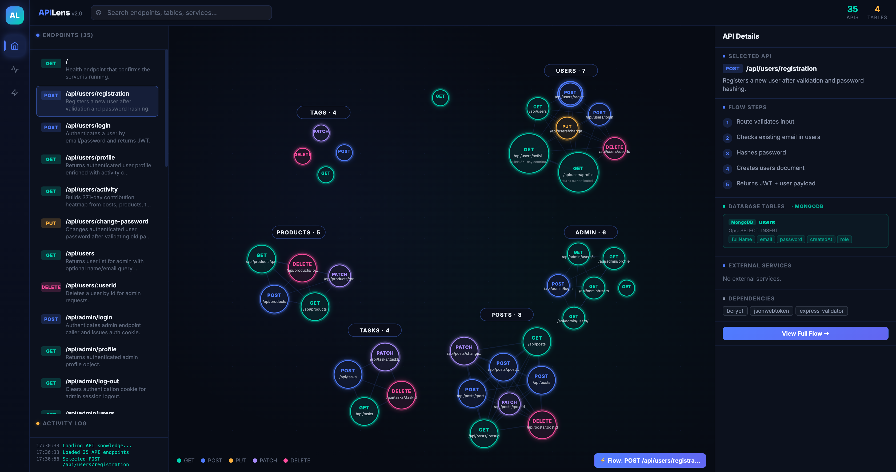
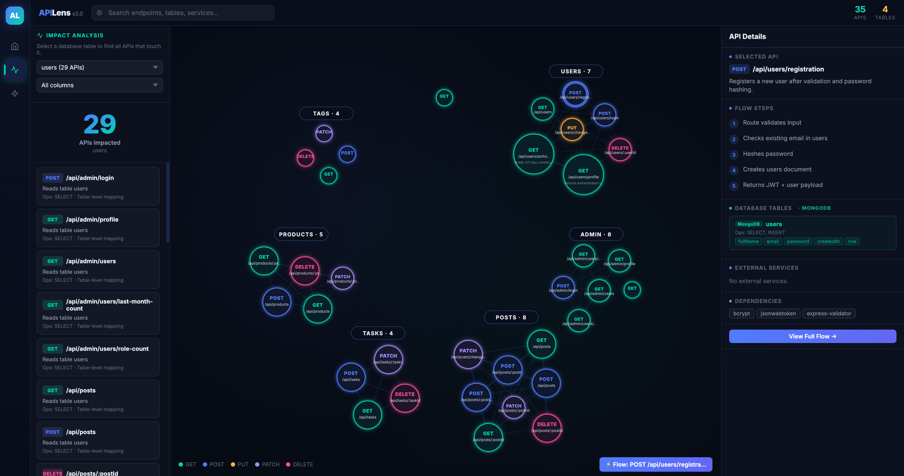
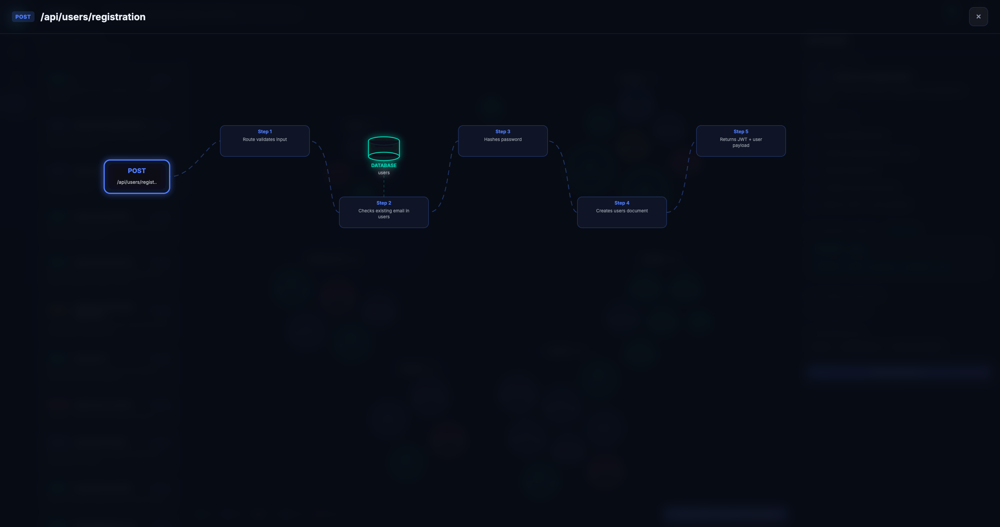

<div align="center">

# APILens

**AI-powered API knowledge graph for Node.js backends**

> Visualise every endpoint, trace business logic step-by-step, and instantly see what breaks when a database column changes.

[](LICENSE)
[](https://nodejs.org)
[](https://npmjs.com/package/apilens)

</div>

---

## What is APILens?

APILens scans your Node.js/TypeScript backend with an AI coding agent and builds a rich, interactive knowledge graph. No manual documentation. No API keys required for serving.

| Feature | Description |
|---|---|
| **Bubble Graph** | One bubble per endpoint, clustered by route domain (users / tasks / products / …) |
| **API Explorer** | Searchable list with one-line summaries, flow steps, DB tables, and dependencies |
| **Flow Overlay** | Step-by-step business logic for each endpoint — with DB, service, and cache nodes |
| **Impact Analysis** | Select any DB table or column to instantly see every API that touches it |

---

## Screenshots

### Explorer — Clustered Bubble Graph



*APIs grouped by route domain. Click any bubble to see its full details in the right panel.*

---

### API Details — Right Panel



*Flow steps, database tables with MongoDB/Prisma badges, dependencies, and a "View Full Flow →" button.*

---

### Impact Analysis — Table / Column Scope



*Select the `users` table → instantly see all 29 APIs that read or write it, with column-level evidence.*

---

### Flow Overlay — Step-by-Step Business Logic



*Full-screen D3 graph tracing each API through its controller → service → database path.*

---

## Quick Start

### 1. Generate scan instructions

```bash
npx apilens scan-prompt /path/to/your/repo
```

This creates `.apilens/SCAN_INSTRUCTIONS.md` inside your target repo and prints:

```
╔══════════════════════════════════════════════════════════╗
║           APILens Scan Instructions Ready                ║
╠══════════════════════════════════════════════════════════╣
║  📄 Instruction file created at:                         ║
║     /your/repo/.apilens/SCAN_INSTRUCTIONS.md              ║
╠══════════════════════════════════════════════════════════╣
║  Next step — open this file in your AI coding agent      ║
║  (Claude Code, Cursor, Copilot, etc.) and run:           ║
║                                                          ║
║    "Follow the instructions in SCAN_INSTRUCTIONS.md"    ║
║                                                          ║
║  The AI will scan your repo and create:                  ║
║    • .apilens/api_knowledge.json  (required)              ║
║    • .apilens/metadata.json       (audit trail)           ║
║                                                          ║
║  Then run:  npx apilens serve .                           ║
╚══════════════════════════════════════════════════════════╝
```

### 2. Run the AI scan

Open `.apilens/SCAN_INSTRUCTIONS.md` in your AI coding agent (Claude Code, Cursor, GitHub Copilot, etc.) and say:

> **"Follow the instructions in SCAN_INSTRUCTIONS.md"**

The agent will scan every route, trace through controllers → services → repositories, and write:
- `.apilens/api_knowledge.json` — full API knowledge (required by dashboard)
- `.apilens/metadata.json` — raw route metadata and audit trail

`graph.json` and `scan_state.json` are derived automatically by the server on first boot — no extra steps needed.

### 3. Launch the dashboard

```bash
npx apilens serve /path/to/your/repo
```

Open **http://localhost:3789** — the full dashboard is ready.

---

## All Commands

| Command | Description |
|---|---|
| `npx apilens init [path]` | Create the `.apilens/` cache directory |
| `npx apilens scan-prompt [path]` | Generate AI scan instructions → writes `.apilens/SCAN_INSTRUCTIONS.md` |
| `npx apilens scan [path]` | Run a local (non-AI) metadata-only scan |
| `npx apilens serve [path]` | Launch the dashboard server on port 3789 |

**Path behaviour:**
- For `init`, `scan`, `scan-prompt`: defaults to the nearest git repository root if no path is given.
- For `serve`: defaults to the current working directory.
- `--dir /path` is accepted by all commands.

**npm script shortcuts:**
```bash
npm run scan:prompt -- /path/to/project
npm run serve       -- /path/to/project
```

---

## Supported Frameworks

| Framework | Detection |
|---|---|
| **Express** | `app.get`, `router.post`, method chains |
| **NestJS** | `@Get`, `@Post`, `@Controller` decorators |
| **Next.js App Router** | `app/api/**/route.ts\|js` with `export function GET\|POST…` |

---

## Cache Files

The AI scan writes to `.apilens/` inside your project:

| File | Required | Description |
|---|---|---|
| `api_knowledge.json` | ✅ Required | Full API metadata — drives all dashboard views |
| `metadata.json` | Optional | Raw route metadata / audit trail |
| `graph.json` | Auto-derived | Built from `api_knowledge.json` on first serve |
| `scan_state.json` | Auto-derived | Scan timestamp and API count |
| `SCAN_INSTRUCTIONS.md` | Generated | AI prompt — open in your coding agent |

---

## Impact Analysis API

```
GET /api/impact                          # table catalog
GET /api/impact?table=users              # all APIs touching `users`
GET /api/impact?table=users&column=email # APIs that access the `email` column
```

---

## Development

```bash
npm test          # run test suite
npm run serve -- ../your-repo   # dev server with real data
```

Server runs at `http://localhost:3789`.

---

<div align="center">
  <sub>Built with ❤️ — scan once, explore forever.</sub>
</div>
